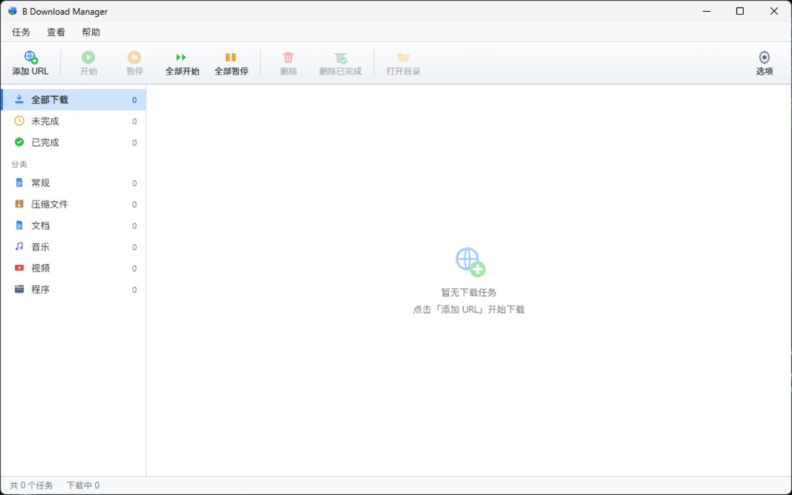
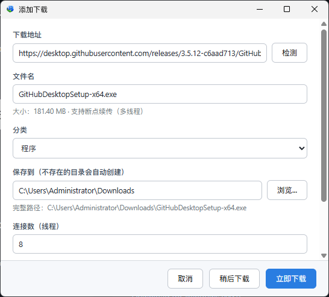
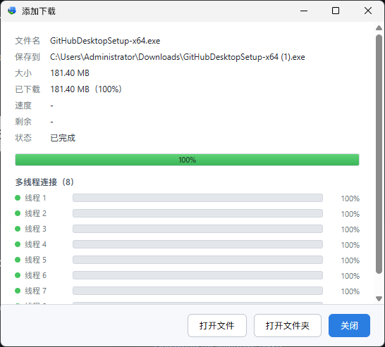
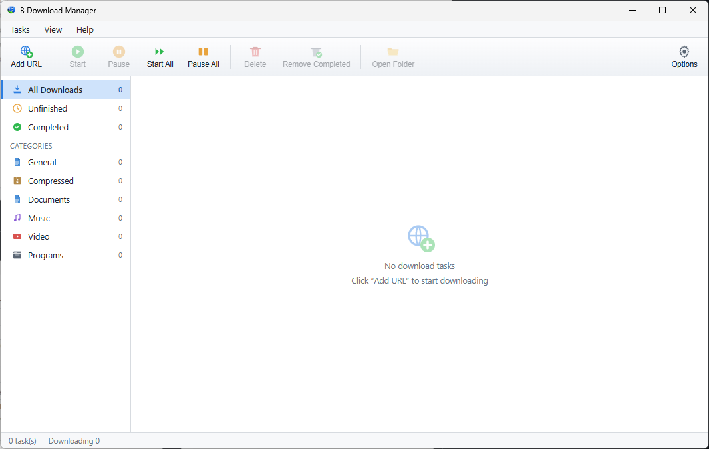
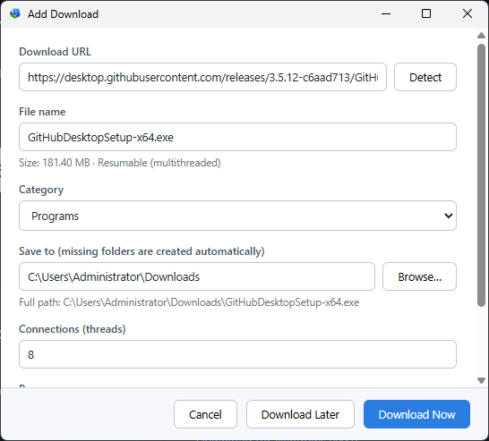
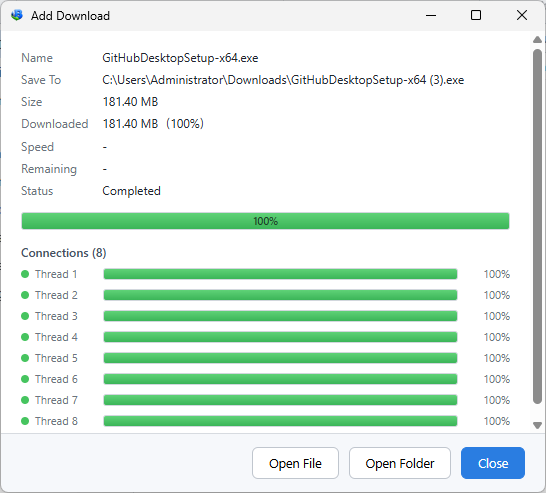

<div align="center">

# B Download Manager

**一款面向 Windows 的现代多线程下载器**

仿 IDM 体验 · 单文件 · 小体积 · 浏览器无缝接管

[](https://github.com/YeBai466/B_Download_Manager/releases)
[](https://wails.io)
[](https://react.dev)
[](LICENSE)
[](https://github.com/YeBai466/B_Download_Manager/releases)
[](https://github.com/YeBai466/B_Download_Manager/stargazers)

简体中文 · [English](#english)

[安装](#安装与更新) · [功能](#核心功能) · [预览](#预览) · [浏览器扩展](#浏览器扩展) · [开发](#开发与构建) · [架构](#项目架构)

</div>

---

## 概览

B Download Manager 使用 **Go + React（Wails v3）** 构建，复用系统内置的 WebView2 而非打包 Chromium，因此发行版始终是**单文件、低占用**。它在保留 IDM 经典工作流的同时，提供崩溃安全的断点续传与开箱即用的浏览器接管能力。

## 预览

<div align="center">



<sub>IDM 风格主界面：工具栏、分类侧栏与任务列表</sub>

</div>

| 添加下载 | 多线程下载进度 |
|:---:|:---:|
|  |  |
| <sub>支持断点续传、分类与连接数设置</sub> | <sub>每条线程的实时进度一目了然</sub> |

## 核心功能

| | 功能 | 说明 |
|---|---|---|
| 🚀 | **多线程分段下载** | 基于 HTTP Range，默认 8 连接并行 |
| ⏸ | **断点续传** | 崩溃安全的 `.bdmeta` sidecar + SQLite 持久化 |
| 🌐 | **浏览器接管** | Chrome / Edge / Firefox 扩展拦截下载并转交本程序 |
| 🛡 | **代理支持** | 系统代理 / 自定义 HTTP(S) / SOCKS5 |
| 🗂 | **IDM 风格界面** | 工具栏、分类侧栏、任务表、独立添加/进度窗口、系统托盘 |
| 🔁 | **开机自启** | 可选最小化到托盘 |
| ⬆ | **自动更新** | 检查 GitHub Releases，展示更新内容并一键跳转 |
| 🌍 | **中英双语** | 「选项 → 语言 / Language」一键切换，界面即时生效 |

## 安装与更新

从 [Releases](https://github.com/YeBai466/B_Download_Manager/releases) 下载最新的 `*-installer.exe` 并安装。

更新时直接下载新版安装包**覆盖安装即可**。下载记录与全部设置保存在 `%AppData%\BDownloadManager`，不随程序更新或卸载而清除（如需彻底清空请手动删除该目录）。安装目录内附带 `uninstall.exe`，也可从「控制面板 → 程序和功能」卸载。

## 浏览器扩展

应用运行时会在 `127.0.0.1:9614` 启动接管服务（端口与开关可在「选项 → 浏览器接管」中调整）。扩展会取消浏览器自带下载并转交本程序——按设置弹出添加对话框或直接开始；**若程序未运行，扩展自动回退为浏览器原生下载。**

#### Chrome / Edge

扩展已发布于 [Chrome 网上应用店](https://chromewebstore.google.com/detail/hgkakilajhnbpmhmpcnblioiiaomdkjp)，提供两种安装方式：

- **一键静默安装** — 在「选项 → 浏览器接管」勾选浏览器并点击「一键安装」（需一次 UAC 管理员授权），重启浏览器后生效。可随时在同一页面卸载。
- **手动安装** — 直接打开 [应用店页面](https://chromewebstore.google.com/detail/hgkakilajhnbpmhmpcnblioiiaomdkjp) 点击「添加至 Chrome」，或搜索 “B Download Manager”。

> 启动时若检测到未安装会弹窗提醒（可选「下次再说 / 从此忽略」），**不会在未经同意的情况下自动安装。**

#### Firefox

打开 `about:debugging#/runtime/this-firefox` →「临时加载附加组件」→ 选择 `extensions/firefox/manifest.json`。

## 环境要求

| 依赖 | 版本 |
|---|---|
| Go | 1.25+（Wails v3 要求） |
| Node.js | 20+ |
| 系统 | Windows 10/11 + WebView2 运行时（通常已内置） |
| Wails CLI | `go install github.com/wailsapp/wails/v3/cmd/wails3@latest` |

## 开发与构建

```bash
wails3 dev      # 开发模式（前后端热重载）
wails3 build    # 生产构建 → bin/b-download-manager.exe
wails3 package  # 生成 NSIS 安装包（需先安装 NSIS：winget install NSIS.NSIS）
```

运行 Go 单元测试：

```bash
go test ./internal/...
```

## 项目架构

```
main.go                 应用入口：窗口、系统托盘、服务装配
internal/
  downloader/           核心下载引擎（探测/分段/续传/调度），与 UI 解耦、可独立测试
  httpclient/ proxy/    代理感知的 HTTP 客户端（系统/自定义/SOCKS5）
  store/                SQLite 持久化（纯 Go modernc 驱动）
  category/             文件分类与落盘目录路由
  takeover/             浏览器接管本地 HTTP 服务
  service/              Wails 绑定服务（暴露给前端的方法 + 事件）
  config/               设置模型与默认值
frontend/src/           React + TS UI（components / api / format / styles）
extensions/
  chromium/             Chrome / Edge 扩展（Manifest V3）
  firefox/              Firefox 扩展（WebExtension）
```

## 测试覆盖

- **`internal/downloader`** — 分段下载、无 Range 单流回退、断点续传、暂停/恢复（含 `-race`）
- **`internal/service`** — 添加 → 下载 → 落盘 → 持久化 全链路
- **`internal/takeover`** — 接管 HTTP 接口（`/ping`、`/download`）与端口热切换
- **`internal/updates`** — 版本号比较与解析

---

## English

**A modern multithreaded download manager for Windows** — IDM-style, single file, small footprint, seamless browser integration.

B Download Manager is built with **Go + React (Wails v3)** and reuses the system WebView2 instead of bundling Chromium, so every release stays a **single, lightweight executable**. It keeps the familiar IDM workflow while adding crash-safe resumable downloads and out-of-the-box browser takeover. The UI ships in **both English and Simplified Chinese** — switch anytime under **Options → Language / 语言**, applied instantly.

<div align="center">



<sub>IDM-style main window: toolbar, category sidebar and task list</sub>

</div>

| Add Download | Multithreaded progress |
|:---:|:---:|
|  |  |
| <sub>Resume support, categories and connection count</sub> | <sub>Live per-thread progress at a glance</sub> |

| | Feature | Details |
|---|---|---|
| 🚀 | **Multithreaded segmented downloads** | HTTP Range, 8 parallel connections by default |
| ⏸ | **Resume support** | Crash-safe `.bdmeta` sidecar + SQLite persistence |
| 🌐 | **Browser takeover** | Chrome / Edge / Firefox extensions intercept and hand off downloads |
| 🛡 | **Proxy support** | System proxy / custom HTTP(S) / SOCKS5 |
| 🗂 | **IDM-style UI** | Toolbar, category sidebar, task table, separate add/progress windows, tray |
| 🔁 | **Launch at login** | Optionally start minimized to the tray |
| ⬆ | **Auto-update** | Checks GitHub Releases, shows the changelog, one-click download |
| 🌍 | **Bilingual UI** | One-click English ⇄ 简体中文, applied instantly |

**Install** — download the latest `*-installer.exe` from [Releases](https://github.com/YeBai466/B_Download_Manager/releases). To update, just run the new installer over the top; your download history and settings live in `%AppData%\BDownloadManager` and survive updates and uninstalls.

**Browser extension** — the app runs a takeover service on `127.0.0.1:9614` (configurable under Options → Browser Integration). The extension is on the [Chrome Web Store](https://chromewebstore.google.com/detail/hgkakilajhnbpmhmpcnblioiiaomdkjp): install it silently with one click from Options, or add it manually from the store page. If the app isn't running, the extension falls back to the browser's native download. For Firefox, load `extensions/firefox/manifest.json` via `about:debugging`.

**Build**

```bash
wails3 dev      # dev mode (hot reload)
wails3 build    # production build → bin/b-download-manager.exe
wails3 package  # NSIS installer (requires NSIS: winget install NSIS.NSIS)
go test ./internal/...   # Go unit tests
```

Requirements: Go 1.25+, Node.js 20+, Windows 10/11 with the WebView2 runtime, and the Wails v3 CLI (`go install github.com/wailsapp/wails/v3/cmd/wails3@latest`).

---

## 许可证 · License

本项目以 [MIT License](LICENSE) 开源发布。 · Released under the [MIT License](LICENSE).

<div align="center">
<sub>Built with Go · Wails v3 · React — for Windows.</sub>
</div>
